# DailyRation

A nutrition tracker for people who cook and don't want or need another account or subscription.

If you make most of your food from real ingredients and you've spent ten minutes inside a mainstream nutrition app wondering where the recipe button is, this is for you.

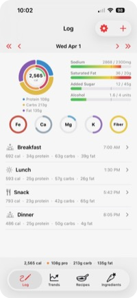

- **Over 350 ingredients on day one.** Eggs, olive oil, black beans, cheddar, oats — the stuff you actually cook with is already there with full USDA nutrition data. No data entry before your first meal.
- **Scan a barcode.** Point your camera at a product barcode and the app looks it up instantly.
- **Scan a nutrition label.** No barcode? Photograph the nutrition facts panel and the app reads it.
- **Search 400,000+ foods.** Need something niche? The full USDA FoodData Central database is a tap away.
- **Enter it yourself.** For anything else, add an ingredient manually with your own nutrition data.
- **Cook a recipe once, log it forever.** Build a recipe out of ingredients, and every time you eat it, log it as one tap.
- **See your day at a glance.** Calories, protein, carbs, fat, plus the micronutrients you actually care about — all on one screen.
- **Trends across days and weeks.** Tap any nutrient on the day view to see a 7-day chart with your target line.
- **Sync across your devices.** iCloud sync is on by default — turn it off in Settings if you want device-only. No account, no signup, no password.
- **Optional Apple Health integration.** Publish what you eat to Health, or pull in your active calories burned to compare against what you ate. Both are off by default and independently configurable.

 

---

## How it's organized
 

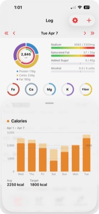

### Log

Your day. The top of the screen is a chart header showing macros, calories vs. target, micronutrients, and limit nutrients (the things you want to stay under). Below that, a list of meals you've logged today.

Swipe left or right anywhere on the day view to walk through previous days.

**Tap any nutrient on the chart** — a ring, a bar, the calorie center, anything — to open a 7-day trend popup with a target line. Swipe inside the popup to walk back through earlier weeks.

 
 

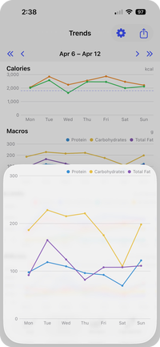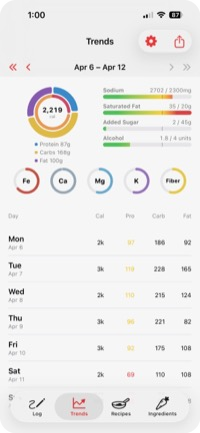

### Trends

Line graphs across a rolling 7-day window: calories, macros, limits, and micronutrients. Tap any chart to expand it. Export daily totals as CSV with a configurable date range.

 
 

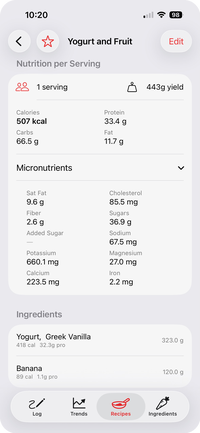

### Recipes

Your cookbook. Each recipe is a list of ingredients with quantities. The nutrition is computed from the ingredients — you don't enter it by hand.

When you log a recipe as a meal, it captures a snapshot of the nutrition at that moment. So if you tweak the recipe later, your historical meals don't change.

 
 

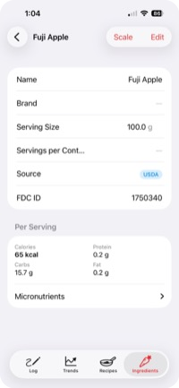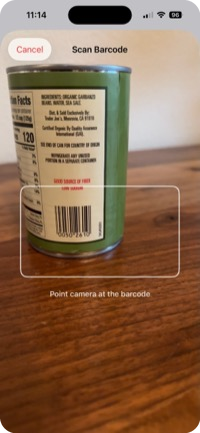

### Ingredients

Your pantry. Scan a barcode, photograph a nutrition label, search the USDA database, or add one by hand — every ingredient lives here with its full nutrition breakdown.

 

---

## Reading the chart header

The chart header packs a lot into a small space. Here's the cheat sheet:

- **Big donut** on the left: macros (protein, carbs, fat). Tap a wedge for that nutrient's trend.
- **Calorie ring** in the middle of the donut: how close you are to your calorie target. Past target it shifts toward red.
- **Inner green ring** (only if you've enabled Apple Health active calories): how much you've burned, scaled against the same calorie target so the two are directly comparable.
- **Limit bars** on the right (Sodium / Saturated Fat / Added Sugar / Alcohol): horizontal bars that go from green to amber to red as you approach or exceed your daily limit. You only see the ones you've enabled in Settings.
- **Micro rings** below (Iron / Calcium / Magnesium / Potassium / Fiber): small rings that fill toward your daily target. Each one can be toggled on or off independently in Settings.

Tap anything to drill in.

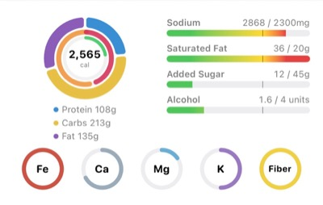

---

## Customizing the display

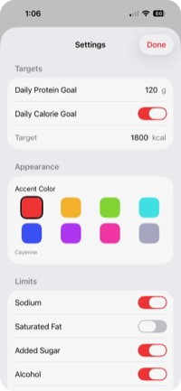

**Settings → Nutrients** lets you toggle each non-macro nutrient on and off independently. If you don't care about Saturated Fat, hide it — the bar disappears from the day view and the rest stays untouched.

**Settings → Appearance** has eight accent colors. The colors flow through every accent in the app — toggles, selection rings, and segmented controls will all have your personal hue.

 

---

## Apple Health

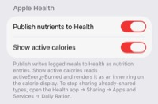

Off by default. Two independent toggles in Settings → Apple Health:

**Publish nutrients to Health.** When on, every meal you save also writes a nutrition entry to Apple Health, grouped under "DailyRation" as a meal correlation. Edits and deletes propagate. To stop sharing later, open the Health app → Sharing → Apps and Services → DailyRation.

**Show active calories.** When on, the calorie display reads your active energy burned from Health and renders a green ring inside the orange calorie ring, scaled to the same target.

These are split because they're useful independently. You might want to publish nutrition to Health without trusting Apple's calorie burn estimate. Or you might want to see your burn against your intake without writing anything back to Health.

 

---

## Works on Mac, too

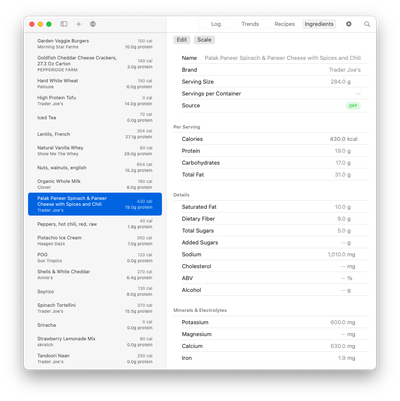

DailyRation runs natively on macOS 14+. Ingredients, recipes, and meal logs are the same data on both platforms — edit on your Mac, log on your phone, or the other way around. The macOS version uses a split-view layout with full keyboard support.

 

---

## Privacy

There is no DailyRation server. Nothing is collected, sold, transmitted, profiled, or analyzed.

- Your data lives on your device. With iCloud sync on (default), it also lives in your private iCloud database — accessible only by you. You can turn sync off in Settings.
- Barcode scans query Open Food Facts and then USDA directly from your device. The only data sent is the barcode number; nothing personal.
- If you fix bad data on an Open Food Facts ingredient, the editor offers (per-submission, opt-in) to send your corrections back so the next person who scans the same product gets the right numbers. You can disable the prompt entirely under Settings.
- Ingredient search hits USDA's public API directly from your device. The query is the food name; nothing personal.
- Apple Health integration is opt-in, runs entirely on-device, and never leaves your iCloud account.

A formal privacy policy ships with the App Store listing.

---

## Requirements

- iPhone or iPad running iOS 17 or later
- Mac running macOS 14 or later
- Apple ID signed in (for iCloud sync — the app works without it, but you'll need it for multi-device)

---

## Support

Found a bug? Have a feature request? [Open an issue.](https://github.com/w15p/dailyration/issues)

---

© 2026 w15p
