# DailyRation

A nutrition tracker for people who cook and don't want or need another account or subscription.

If you make most of your food from real ingredients and you've spent ten minutes inside a mainstream nutrition app wondering where the recipe button is, this is for you.

  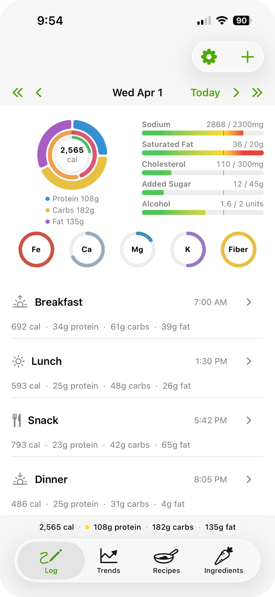

- **Over 350 ingredients on day one.** Eggs, olive oil, black beans, cheddar, oats — the stuff you cook with is already there with full USDA nutrition data. No data entry before your first meal.
- **Scan a barcode.** Point your camera at a product barcode and the app looks it up instantly.
- **Scan a nutrition label.** No barcode? Photograph the nutrition facts panel and the app reads it.
- **Search USDA and Open Food Facts.** Type a food name and search the full USDA FoodData Central database (whole, raw ingredients) or Open Food Facts (branded and packaged products USDA does not carry). Flip between the two catalogs with one tap, pick a result, review it, and save.
- **Enter it yourself.** For anything else, add an ingredient manually with your own nutrition data.
- **Organized like a kitchen.** Your library auto-groups into Fruits, Vegetables, Dairy & Eggs, Sweets, and more: fifteen buckets that match how you shop. USDA seed items and barcode-scanned products land in the right place automatically.
- **Cook a recipe once, log it forever.** Build a recipe out of ingredients, and every time you eat it, log it as one tap.
- **See your day at a glance.** Calories, protein, carbs, fat, plus the micronutrients and limits you actually care about, all on one screen.
- **Trends across days and weeks.** Tap any nutrient on the day view to see a 7-day chart with your target line.
- **Sync across your devices.** iCloud sync is on by default — turn it off in Settings if you want device-only. No account, no signup, no password.
- **Optional Apple Health integration.** Pull in your active calories burned to compare against what you ate. Off by default; the app reads from Health and never writes to it.

---

## How it's organized

### Log

Your day. The top of the screen is a chart header showing macros, calories vs. target, micronutrients, and limits. Below that, a list of meals you've logged today. On iPhone or iPad, long-press the app icon to jump straight to Log a Meal.

Swipe left or right anywhere on the day view to walk through previous days.

**Tap any nutrient or limit on the chart** to open a 7-day trend popup with a target line. Swipe inside the popup to walk back through earlier weeks.

  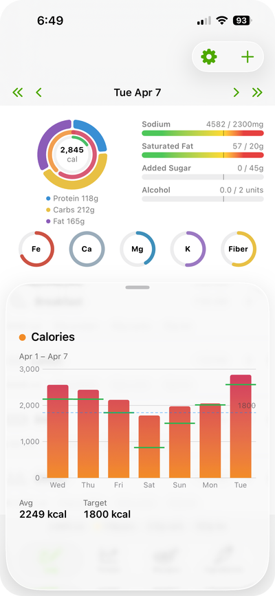

### Trends

Line graphs across a rolling 7-day window: calories, macros, limits, and micronutrients. Tap any chart to expand it. Export daily totals as CSV with a configurable date range.

  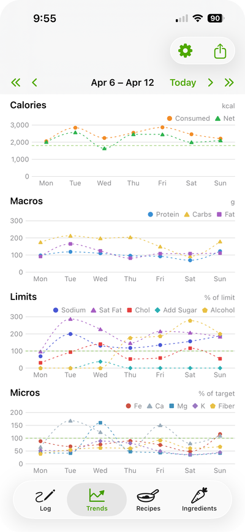
  &nbsp;
  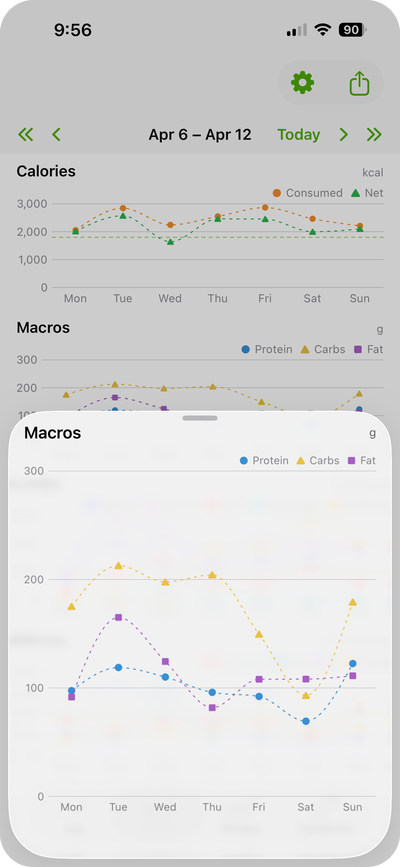

### Recipes

Your cookbook. Each recipe is a list of ingredients with quantities. The nutrition is computed from the ingredients, not entered by hand.

When you log a recipe as a meal, it captures a snapshot of the nutrition at that moment. So if you tweak the recipe later, your historical meals don't change.

**Two shortcuts worth knowing:**

- In the Log tab, press and hold a meal (right-click on Mac) and choose **Save as Recipe** - one step turns a one-off dinner into a reusable recipe. It also relinks that logged meal to point at the new recipe, so the day's entry now reads as the recipe you just made.
- When logging a meal, press and hold a recipe in the picker and choose **Use as Template**. Instead of logging the recipe as one line, it pre-fills the meal with the recipe's individual ingredients, so you can tweak this serving (swap an ingredient, change a quantity) before saving. A normal tap still logs the recipe as one item.

  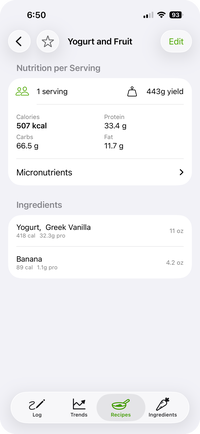
  &nbsp;
  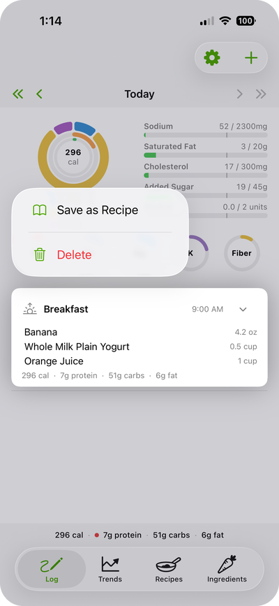
  &nbsp;
  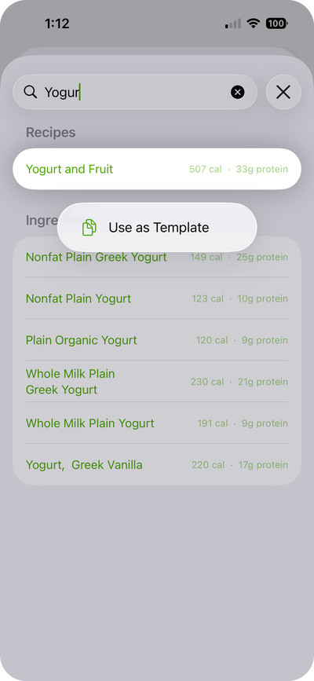

### Ingredients

Your pantry. Scan a barcode, photograph a nutrition label, search USDA or Open Food Facts by name, or add one by hand - every ingredient lives here with its full nutrition breakdown. Scanned products arrive pre-filled, including the right category, so most of the time you just glance and save. On iPhone or iPad, long-press the app icon to jump straight to Scan Barcode or Scan Label.

  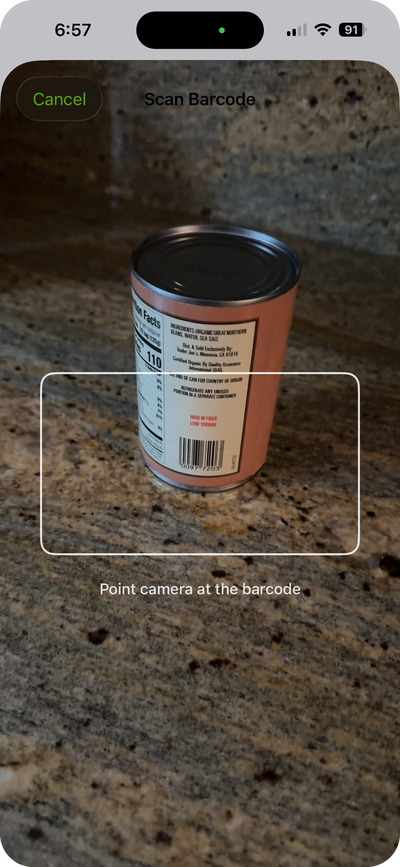
  &nbsp;
  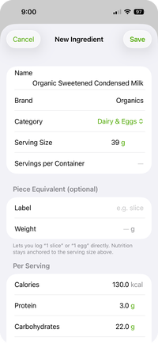

---

## Reading the chart header

The chart header packs a lot into a small space.

- **Macro ring**: protein, carbs, fat. Tap a wedge for that nutrient's trend.
- **Calorie inner ring**: how close you are to your calorie target. Past target it shifts toward red.
- **Active calorie inner ring** (only if you've enabled Apple Health active calories): how much you've burned, scaled against the same calorie target so the two are directly comparable.
- **Limit bars** (Sodium / Saturated Fat / Cholesterol / Added Sugar / Alcohol): horizontal bars that go from green to amber to red as you approach or exceed your daily limit. You only see what is enabled in Settings.
- **Micro rings** (Iron / Calcium / Magnesium / Potassium / Fiber): small rings that fill toward your daily target. Each one can be toggled on or off independently in Settings.

Tap anything to drill in.

  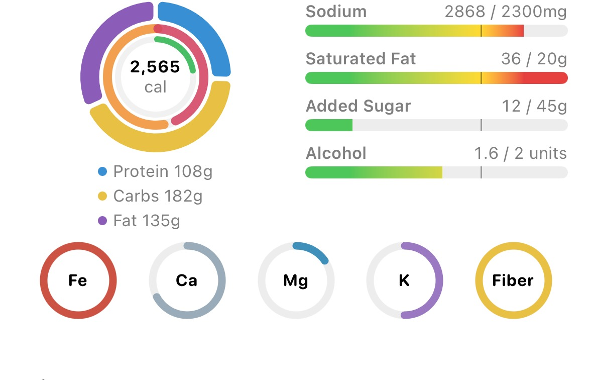

---

## Customizing the display

**Settings → Nutrition** lets you toggle each non-macro nutrient or limit on and off independently. If you don't care about Saturated Fat, hide it - the bar disappears from the day view and the rest stays untouched.

**Settings → Display** has eight accent colors. The colors flow through every accent in the app - toggles, selection rings, and segmented controls will all have your personal hue.

Every color is tuned to read well in both light and dark mode, on iPhone, iPad, and Mac.

  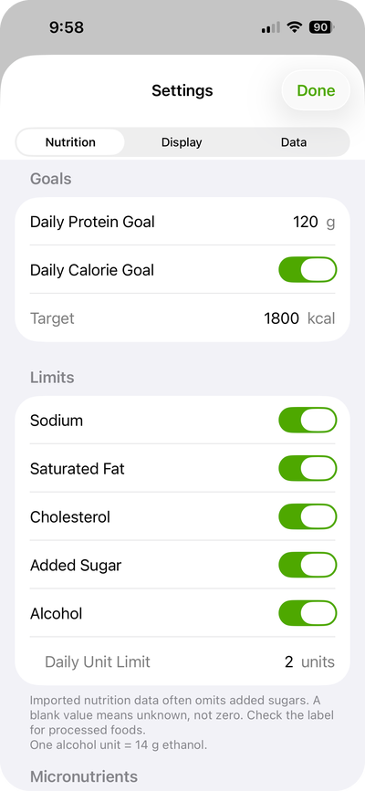
  &nbsp;
  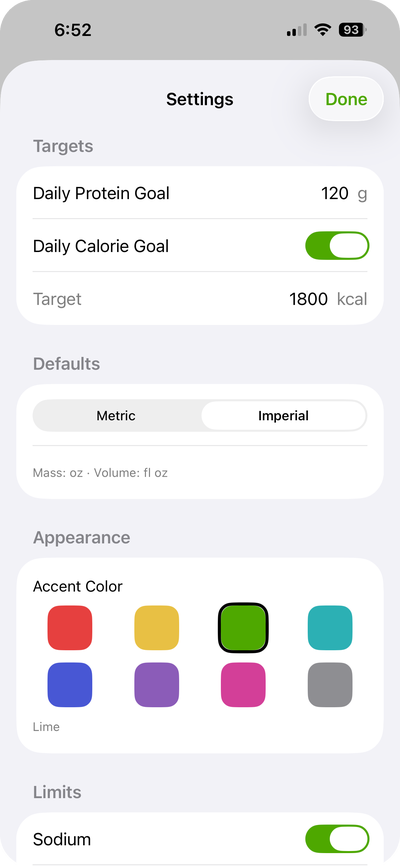

---

## Apple Health

Off by default, in Settings → Data → Apple Health:

**Show active calories.** When on, the calorie display reads your active energy burned from Health and renders a green active calorie ring inside the orange calorie ring, scaled to the same target. The app only reads from Health; it never writes anything back. To stop sharing later, open the Health app → Sharing → Apps and Services → DailyRation.

  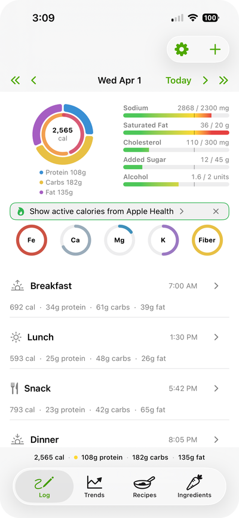

  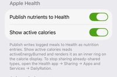

---

## Works on Mac, too

DailyRation runs natively on macOS 14+. Ingredients, recipes, and meal logs are the same data on both platforms. Edit a recipe on your Mac, log it from your phone. Your whole day reads at a glance on a desktop screen, and the split-view layout turns Recipes and Ingredients into a real kitchen reference: sort the sidebar by category, source, or name; see full nutrition on the right. Arrow-key navigation throughout.

  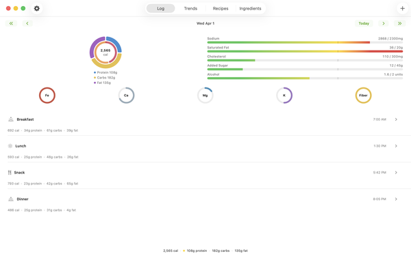
  &nbsp;
  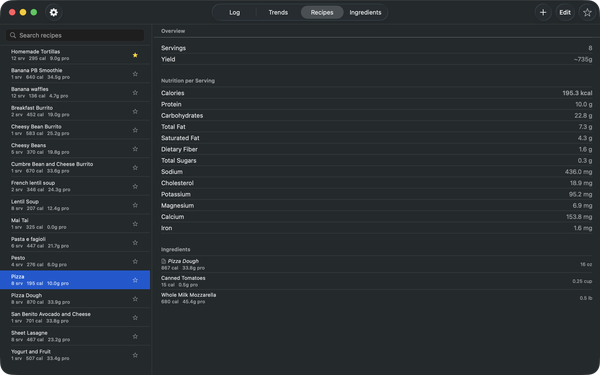

---

## Privacy

There is no DailyRation server. Nothing is collected, sold, or transmitted.

- Your data lives on your device. With iCloud sync on (default), it also lives in your private iCloud database, accessible only by you. You can turn sync off in Settings.
- Barcode scans query Open Food Facts and then USDA directly from your device. The only data sent is the barcode number; nothing personal.
- Sending corrections back to Open Food Facts is off by default. If you turn it on under Settings → Data, the editor will offer (per submission) to push your fixes upstream so the next person who scans the same product gets the right numbers. The submission includes the corrected values, the barcode, and a per-install identifier Open Food Facts uses for app attribution (not your Apple ID or name). Even then it never sends anything without you tapping Submit.
- Ingredient name search hits USDA's public API or Open Food Facts' search service (search.openfoodfacts.org), depending on which catalog you pick, directly from your device. The query is the food name; nothing personal.
- Apple Health integration is opt-in, runs entirely on-device, and no health data is sent to any server.

**[Full Privacy Policy →](https://w15p.github.io/DailyRation/privacy)** &nbsp; (also referenced from the App Store listing)

---

## Requirements

- iPhone or iPad running iOS 17 or later
- Mac running macOS 14 or later
- Apple ID signed in (for iCloud sync; the app works without it, but you'll need it for multi-device)

---

## Support

Found a bug? Have a feature request? [Open an issue.](https://github.com/w15p/DailyRation/issues)

---

© 2026 w15p
